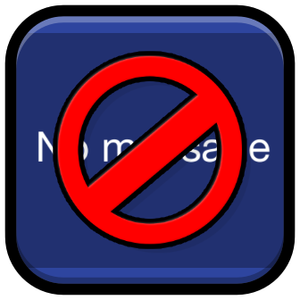

# No Empty Friend Requests
For those who hate empty friend reqs (aka me lol)

> [!WARNING]
> Setting the setting values for "Interval" and "Cooldown" in a low enough value may cause you to get *rate limited*, so be careful!

## Why?
Cuz I get like 10000000 empty friend requests and I don't like leaving them hanging in there so I have to manually decline them myself, and it's very annoying! While some of the issues are me being, well, me (lol), I think this is a more convenient solution to this problem (I mean I can't be the only one, right? Right???)

## License
This mod is licensed under the **MIT License**. More information about it can be found [here](https://choosealicense.com/licenses/mit/).